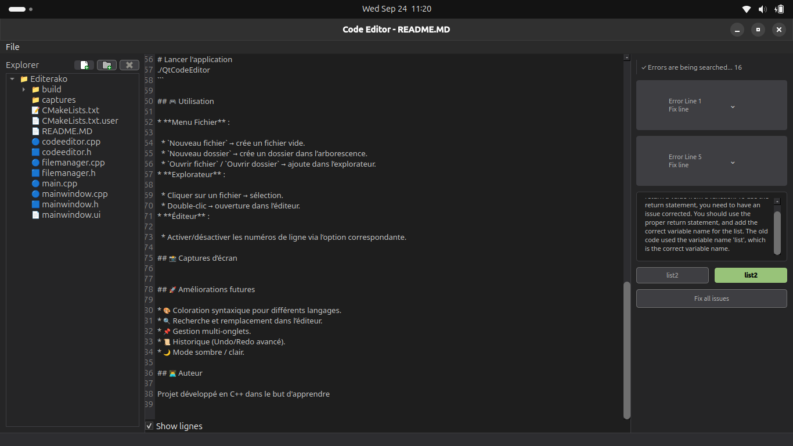

# Qt Code Editor Project

## 📌 Description

Ce projet est un **éditeur de code minimaliste** développé en **C++ avec Qt**.
Il intègre un explorateur de fichiers, un éditeur de texte avec **numéros de ligne** et une interface graphique intuitive basée sur **QMainWindow**.

## ✨ Fonctionnalités

* 📂 **Explorateur de fichiers** intégré avec navigation dans les dossiers.
* 📑 Création de **nouveaux fichiers** et **nouveaux dossiers** depuis l’UI.
* 📖 Ouverture de fichiers texte/code directement dans l’éditeur.
* 📝 **Éditeur de code personnalisé** (`CodeEditor`) avec :

  * Numérotation de lignes (activable/désactivable).
  * Mise en surbrillance de la ligne courante.
* 💾 Sauvegarde des fichiers ouverts/modifiés.
* ⚠️ Avertissement en cas de fermeture avec des modifications non sauvegardées.

## 📂 Structure du projet

```
.
├── captures/           # Captures d'écran (si disponibles)
├── CMakeLists.txt      # Configuration du projet pour CMake
├── codeeditor.cpp/.h   # Classe personnalisée de l'éditeur de code avec numéros de ligne
├── filemanager.cpp/.h  # Gestionnaire de fichiers (explorateur et opérations associées)
├── main.cpp            # Point d'entrée du programme
├── mainwindow.cpp/.h   # Fenêtre principale (menus, slots, intégration)
├── mainwindow.ui       # Interface graphique (Qt Designer)
└── README.MD           # Documentation du projet
```

## 🛠️ Compilation & Exécution

### Prérequis

* [Qt 6](https://www.qt.io/download) (ou Qt 5)
* CMake (≥ 3.16)
* Un compilateur C++ compatible (GCC, Clang, MSVC)

### Étapes

```bash
# Cloner le dépôt
git clone https://github.com/ToavinaJr/editerako-app.git
cd editerako-app

# Créer un dossier de build
mkdir build && cd build

# Générer et compiler
cmake ..
make -j$(nproc)

# Lancer l'application
./QtCodeEditor
```

## 🎮 Utilisation

* **Menu Fichier** :

  * `Nouveau fichier` → crée un fichier vide.
  * `Nouveau dossier` → crée un dossier dans l’arborescence.
  * `Ouvrir fichier` / `Ouvrir dossier` → ajoute dans l’explorateur.
* **Explorateur** :

  * Cliquer sur un fichier → sélection.
  * Double-clic → ouverture dans l’éditeur.
* **Éditeur** :

  * Activer/désactiver les numéros de ligne via l’option correspondante.

## 📸 Captures d’écran


## 🚀 Améliorations futures

* 🎨 Coloration syntaxique pour différents langages.
* 🔍 Recherche et remplacement dans l’éditeur.
* 📌 Gestion multi-onglets.
* 📜 Historique (Undo/Redo avancé).
* 🌙 Mode sombre / clair.

## 👨‍💻 Auteur

Projet développé en C++ dans le but d'apprendre
