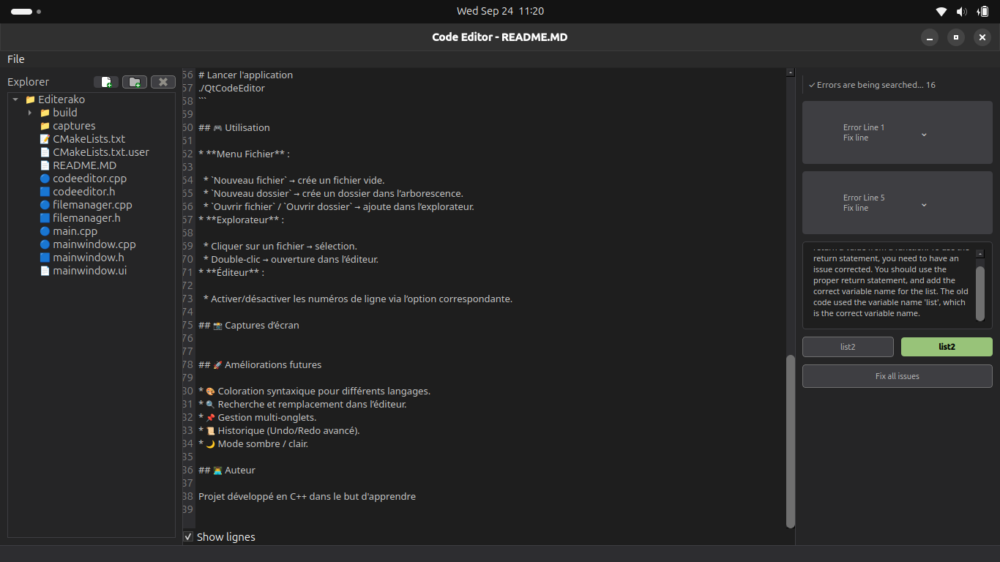

# Editerako

Éditeur de code / mini-IDE en **C++20** et **Qt 6 Widgets**.

Documentation détaillée : [docs/](docs/README.md) (architecture, build, conventions, tests).

## Features

- Éditeur `QPlainTextEdit` personnalisé, numéros de ligne, multi-onglets, multi-curseurs, déplacement de lignes, indent, commentaires, paires auto
- Coloration syntaxique Tree-sitter (C, C++, CMake, Python, JS, TS, TSX, JSON, HTML, CSS, Markdown, Shell, SQL, YAML)
- Ouverture / sauvegarde de fichiers, marqueur modifié, drag & drop
- Recherche, remplacement, regex, Go To Line
- Command Palette (`Ctrl+Shift+P`), Quick Open (`Ctrl+P`, `fichier:ligne`), Search workspace (`Ctrl+Shift+F`)
- Explorateur de fichiers, menu contextuel (rename, delete, copy/cut/paste, …), création de fichiers et de dossiers
- Prévisualisation PDF et images
- Terminal intégré (plusieurs sessions, historique, autocomplete, découverte de commandes via `QProcess`)
- Chat IA Gemini, historique SQLite par projet (`.editerako/`, non versionné)

## Screenshots



## Requirements

- **CMake** ≥ 3.21, **Ninja**, compilateur C++20
- **Qt 6** : Widgets, Network, Sql, Concurrent, **PdfWidgets** (module Qt PDF), Test

Qt est localisé via `CMAKE_PREFIX_PATH`, `QTDIR`, `qtpaths` / `qmake`, ou (Windows) `C:\Qt\<version>\mingw_64`. Détail : [docs/build.md](docs/build.md).

## Build Windows

```powershell
.\scripts\configure.ps1
.\scripts\build.ps1
.\scripts\run.ps1
```

Si les scripts sont bloqués : `Set-ExecutionPolicy -Scope CurrentUser RemoteSigned`.

Release : ajouter `-Config Release`. Compiler puis lancer : `.\scripts\run.ps1 -Build`. Tests : `.\scripts\test.ps1`. Nettoyage : `.\scripts\clean.ps1` (`-All` pour tout `build/`).

CMake : `cmake --preset debug` puis `cmake --build --preset debug`.

CI, sanitizers (ASan+UBSan, TSan) et packaging : [docs/ci.md](docs/ci.md). Windows portable : `.\scripts\package.ps1` (Release).

Qt Creator : ouvrir `CMakeLists.txt`, kit Qt 6 **avec PdfWidgets**. Le kit (`build/Desktop_Qt_…`) est distinct de `build/debug`.

## Build Linux

```bash
./scripts/configure.sh
./scripts/build.sh
./scripts/run.sh
```

Release : argument `Release`. Compiler puis lancer : `./scripts/run.sh --build`. Tests : `./scripts/test.sh`. Sur certaines distros, installer **Qt PDF** en plus de Widgets.

## AI

Le panneau chat se connecte par **sign-in** à votre compte (ChatGPT, Claude, Gemini Google, Copilot). Aucune clé Gemini n’est requise pour ça.

Les backends API (Gemini, OpenAI, Anthropic, Ollama) restent optionnels : copier [`.env.example`](.env.example) vers `.env` si vous les utilisez. Ne jamais committer de clé.

## Contributing

Suivre [docs/conventions.md](docs/conventions.md). Ne pas versionner `build/`, `.env`, ni `{projet}/.editerako/`.
